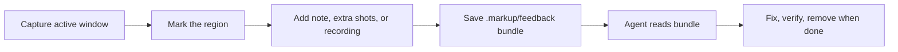

# Markup

<div align="center">

**Visual feedback bundles for installed apps, browser tabs, and local dev servers.**

Markup is a local-first macOS menu bar app for capturing UI feedback, marking the exact problem, and saving an agent-ready work bundle directly inside the project that should be fixed.

[](https://github.com/rikuws/markup/releases/latest)


[](https://sparkle-project.org/)

[Download DMG](https://github.com/rikuws/markup/releases/latest/download/markup-latest-macos.dmg)
&nbsp;&middot;&nbsp;
[Download ZIP](https://github.com/rikuws/markup/releases/latest/download/markup-latest-macos.zip)
&nbsp;&middot;&nbsp;
[Releases](https://github.com/rikuws/markup/releases/latest)

</div>

## Why Markup?

Screenshots in chat are easy to lose. Bug reports without pixels are easy to misunderstand. Markup keeps visual feedback where the code lives: every capture becomes a plain-file folder with an instruction, metadata, annotated screenshots, originals, and an optional short recording.

That gives coding agents the same context a human reviewer would want: what app was captured, what window or browser page it came from, where the user pointed, what they wrote, and which project route should receive the fix.

**Markup does not require the thing you are reviewing to be installed.** If the UI is running from `npm run dev`, `vite`, `next dev`, `cargo tauri dev`, a localhost browser tab, or any other transient development window, Markup can still capture it and route the feedback by page or project context. That makes it useful while the product is still being built, before there is a packaged app to install.



## Features

| Feature | What it does |
| --- | --- |
| Menu bar capture | Capture the active window from the menu bar or with the default `Cmd+Shift+M` hotkey. |
| Dev-mode friendly | Capture local development builds, localhost browser tabs, and uninstalled app windows. |
| Region markup | Draw one clear target region per screenshot so the issue is visible at a glance. |
| Multi-shot feedback | Add up to six screenshots to one feedback item for multi-state or responsive issues. |
| Short recordings | Attach a focused screen recording when motion, timing, or interaction matters. |
| App and browser routing | Route native apps by app identity and browser pages by local host, repository, Figma file, Google Doc, or host. |
| Feedback inbox | Review pending feedback by project, open screenshots, edit notes, reveal folders, or move handled items to Trash. |
| Agent-ready files | Save `instruction.md`, `metadata.json`, screenshots, originals, and optional `recording.mov` in the target repo. |
| Native updates | Sparkle checks signed GitHub releases and lets users update from inside the app. |

## Install

1. Download the latest [DMG](https://github.com/rikuws/markup/releases/latest/download/markup-latest-macos.dmg) or [ZIP](https://github.com/rikuws/markup/releases/latest/download/markup-latest-macos.zip).
2. Move `Markup.app` to `/Applications`.
3. Launch Markup and grant Screen Recording permission when macOS asks.
4. Open Settings to configure the hotkey, app routes, updates, and the feedback inbox notch.

Markup requires macOS 13 or newer. The first install comes from the DMG or ZIP; later signed releases can be installed from **Check for Updates**. Accessibility permission is useful for richer browser/page context and can be opened from Settings.

## Workflow

1. Focus the installed app, uninstalled dev build, or browser page you are reviewing.
2. Press `Cmd+Shift+M` or choose **Capture Feedback** from the menu bar item.
3. Draw a box around the issue.
4. Add a note that says what should change.
5. Add extra screenshots or a short recording if one frame is not enough.
6. Save the bundle to the configured project route.
7. Ask your coding agent to process the pending Markup feedback.

The default feedback path is `.markup/feedback`, but each app or browser route can point at a different project root and relative feedback path.

## Bundle Format

Markup writes ordinary files so humans, scripts, and agents can all inspect the same source of truth.

```text
.markup/feedback/
  20260703-153015-safari-a1b2c3/
    instruction.md
    metadata.json
    screenshot.png
    screenshot-original.png
    screenshot-2.png
    screenshot-original-2.png
    recording.mov
```

`instruction.md` contains the user note, screenshots list, app/window/browser context, and done-when criteria. `metadata.json` stores structured capture data, route information, highlighted regions, asset names, and schema version. Extra screenshots and `recording.mov` appear only when attached.

## Use With Coding Agents

This repository includes a reusable agent skill at [`skills/markup-feedbacks`](skills/markup-feedbacks). Install it into a compatible agent environment, then ask the agent to process the oldest or all pending bundles in the current repo.

For Codex-style local skills:

```bash
mkdir -p ~/.codex/skills/markup-feedbacks
cp -R skills/markup-feedbacks/. ~/.codex/skills/markup-feedbacks/
```

Then ask:

```text
Use the Markup feedbacks skill to process the oldest pending feedback bundle in this repo.
```

The skill lists feedback bundles, reads `instruction.md` and `metadata.json`, inspects screenshots and recordings, implements the fix, verifies it, and removes the bundle only after the work is done.

## Development

Markup is a Swift Package Manager macOS app. There is no Xcode project required.

```bash
swift package resolve
swift build
```

Build a local `.app` bundle:

```bash
./scripts/build-app.sh
```

Create a local development package without Developer ID signing:

```bash
MARKUP_ALLOW_DEVELOPMENT_PACKAGE=1 MARKUP_SIGNING_MODE=adhoc ./scripts/package-app.sh
```

Useful paths:

| Path | Purpose |
| --- | --- |
| [`Sources/Markup`](Sources/Markup) | AppKit and SwiftUI application source. |
| [`Sources/Markup/Resources`](Sources/Markup/Resources) | App icon and menu bar assets. |
| [`scripts`](scripts) | Build, package, signing, notarization, Sparkle, and release helpers. |
| [`.github/workflows/release.yml`](.github/workflows/release.yml) | GitHub Actions workflow for CI packages and tagged releases. |
| [`skills/markup-feedbacks`](skills/markup-feedbacks) | Agent workflow for consuming saved feedback bundles. |

## Releases

Tagged releases are built by GitHub Actions. Pushing a `vX.Y.Z` tag triggers the macOS packaging workflow, signs and notarizes release artifacts, generates Sparkle update assets, uploads checksum files, and publishes latest DMG/ZIP aliases.

Release signing expects these GitHub secrets:

| Secret | Purpose |
| --- | --- |
| `MARKUP_DEVELOPER_ID_CERTIFICATE_BASE64` | Base64-encoded Developer ID Application certificate. |
| `MARKUP_DEVELOPER_ID_CERTIFICATE_PASSWORD` | Password for the certificate archive. |
| `MARKUP_APPLE_ID` | Apple ID used for notarization. |
| `MARKUP_APPLE_APP_SPECIFIC_PASSWORD` | App-specific password for notarization. |
| `MARKUP_APPLE_TEAM_ID` | Apple Developer Team ID. |
| `MARKUP_SPARKLE_PUBLIC_ED_KEY` | Sparkle public EdDSA key embedded in the app. |
| `MARKUP_SPARKLE_PRIVATE_ED_KEY` | Sparkle private EdDSA key used for appcast signing. |

Generate Sparkle keys from the resolved SwiftPM artifact:

```bash
swift package resolve
.build/artifacts/sparkle/Sparkle/bin/generate_keys
.build/artifacts/sparkle/Sparkle/bin/generate_keys -x sparkle_private_key
```

Keep the private key only in release secrets.

## Principles

- **Local first:** captures are written to the project route you configure, not uploaded to a service.
- **Plain files:** feedback is useful in Finder, Git, scripts, and agents.
- **Specific context:** a marked region, source screenshot, route metadata, and note beat vague visual bug reports.
- **Human controlled:** bundles stay pending until a human or agent processes them.

## Privacy

Markup does not upload captures. Screenshots, notes, metadata, and recordings are saved locally in the feedback directory for the configured route.

## License

No license has been declared yet.
